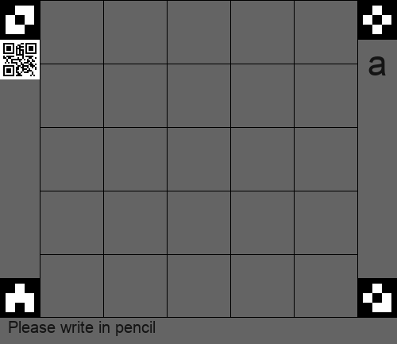
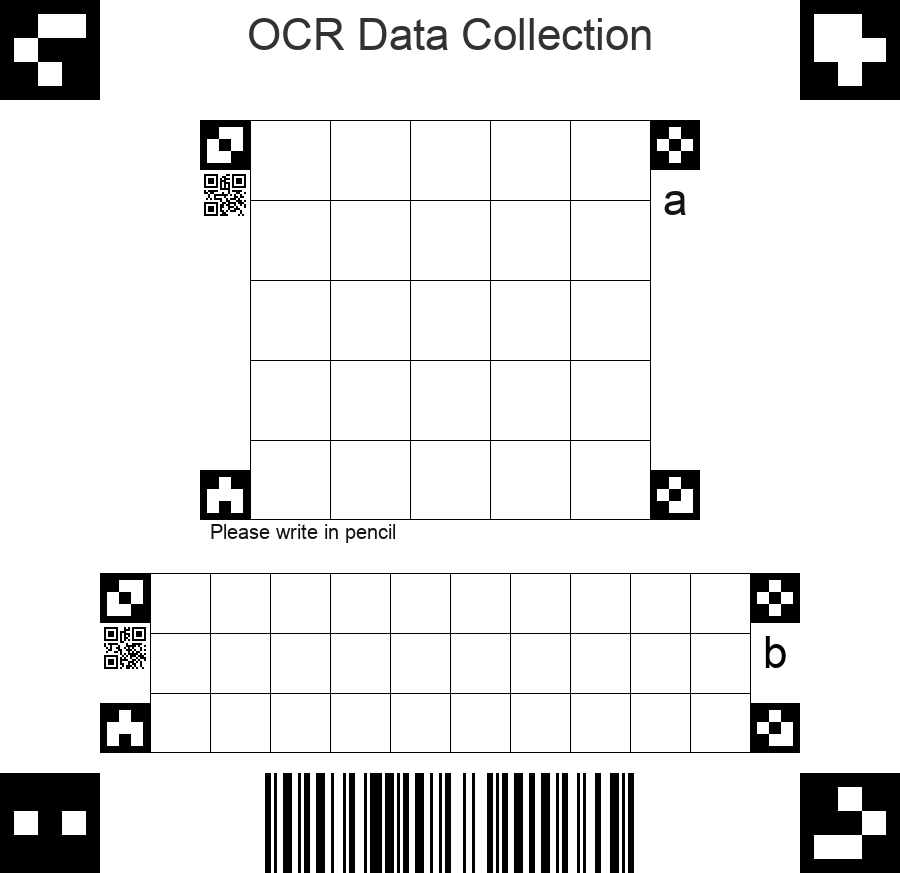

# OCR Data Collector

> John Montgomery 29/03 - for NEA 2022

### A tool to help gather and digitise data for OCR

This is a relatively thrown together package, but allows for the essential requirements I had. These were that it would
use fiducials and QR codes, along with a table, to allow for collection of handwritten data.

The need for this came with the fact that, whilst there is a large prevalence of datasets with the more common
characters, I needed more complex symbols for a boolean algebra recognition program I was writing. 

The code generates a table, with a fiducial at each corner, along with a QR code which stores basic data like what 
character was being collected and the size of the tables (in relative units to the fiducials) - the code also has a
mechanism to record id's of each table generated in the QR code

## How the data is formatted

#### 1- .npy file (default)
This will store the data into a npy file, in the following format:

2 files will be generated:

- File 1 (default - `lables.npy`) contains an array of integers which corresponds to the group provided when running the code
- File 2 (default `data.npy`) contains an array of 2D arrays which store the image data

#### 2- A CSV with paths
This will store the data into a CSV (default `ocr.csv`) of the following format:
- The path to the date
- The label

#### 3- A CSV with data
This will store the data into a CSV (default `ocr.csv`) of the following format:
- The label
- The data, each pixel being one column

## Other Information Stored

#### In addition to the data collected, other files are created
- If unique ID's were used in the QR codes, a file (default `uid.csv`) will be created. This has a 1:1 reference with the
data and labels
  
- A txt file with extra data (`meta.txt`), and some basic info on the data collected:
    - Timestamp (of files creation)
    - List of files created  
    - Size of files created
    - Number of files created
    - Number of images collected
    - Shape of images outputed
    - Number of labels
    - Number of users/UID's (if used)
  
## Examples
### Creating the forms
#### Single label
```python
from OCR-data-collector import Generate
form_a = Generate('a')
form_a.show_image()
```


#### Combining single label forms
```python
from OCR-data-collector import Generate, Group
form_a = Generate('a')
form_b = Generate('b')
combined_form = Group([form_a,form_b])
combined_form.show_image()
```


#### More complex examples
```python
from OCR-data-collector import Generate, Group
form_a = Generate(
    'a',
    box_size = (80,80),
    form_size = (5,5),
    UID = 2133,
    comment = 'Please write in pencil',
    font_path = 'Arial',
    background = (100,100,100,255),
    comment_colour = (20,20,20)
)
form_a.show_image()
form_a.save_image('/some/path/filename.png')
```

```python
from OCR-data-collector import Generate, Group

form_a = Generate(
    'a',
    box_size=(80, 80),
    form_size=(5, 5),
    UID=2133,
    comment='Please write in pencil',
    font_path='Arial',
    background=(255, 255, 255, 255),
    comment_colour=(20, 20, 20)
)
form_b = Generate('b')
form_group = Group(
    [form_a,form_b],
    page_id=1234,
    font_path='Arial',
    title = 'OCR Data Collection',
    title_colour=(50,50,50)
)
form_group.show_image()
```

